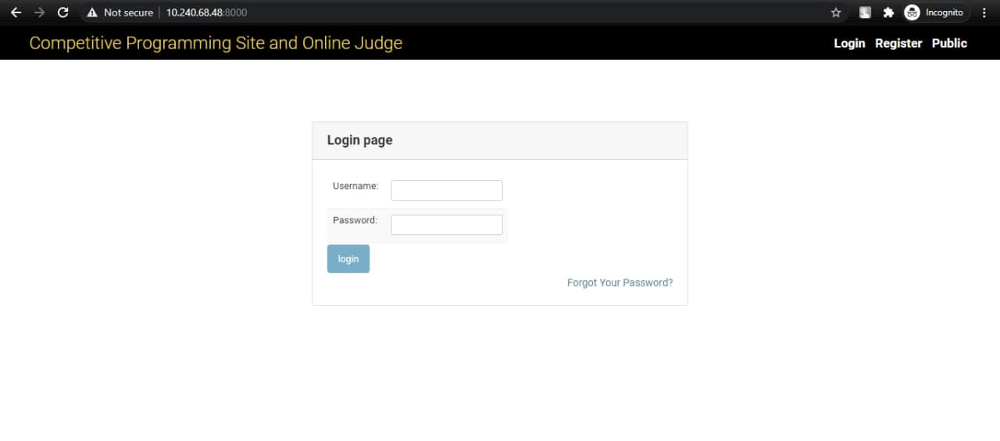
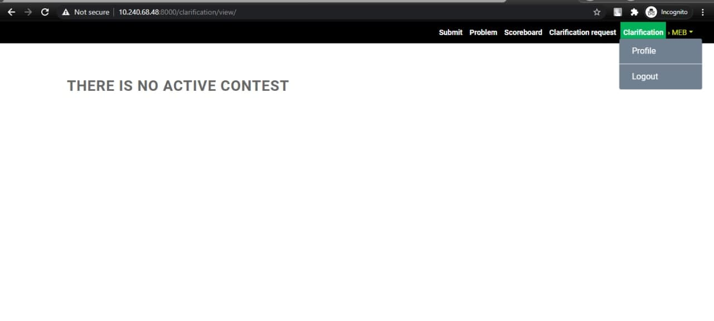
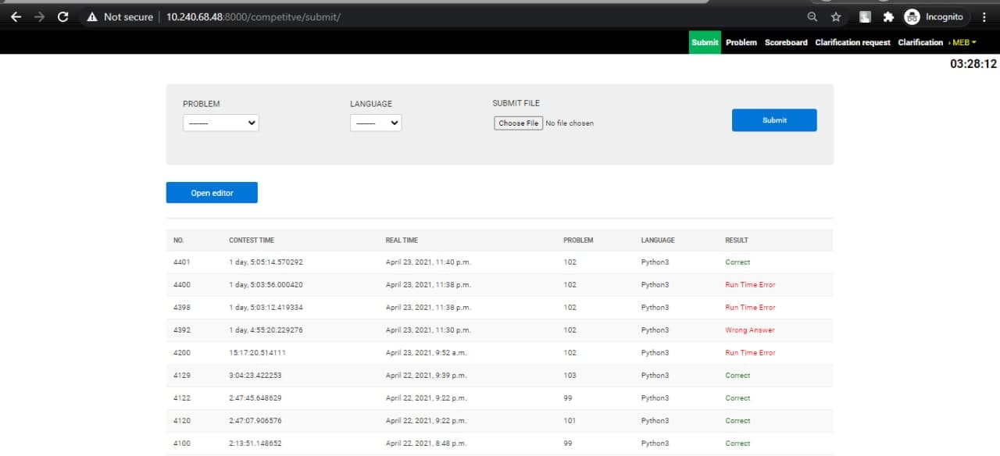
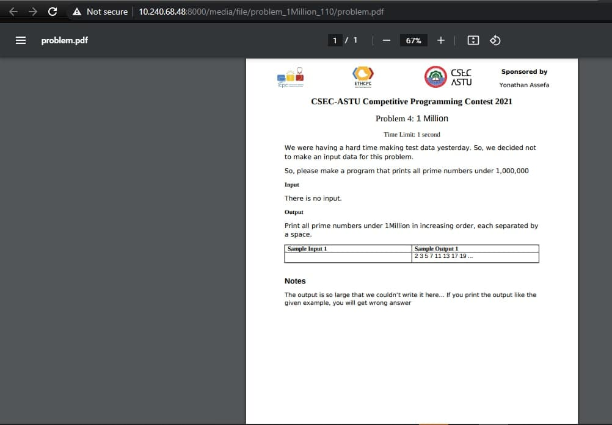
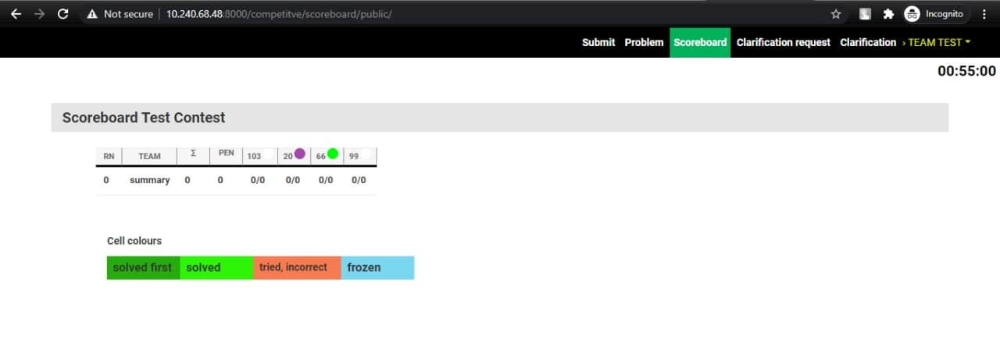
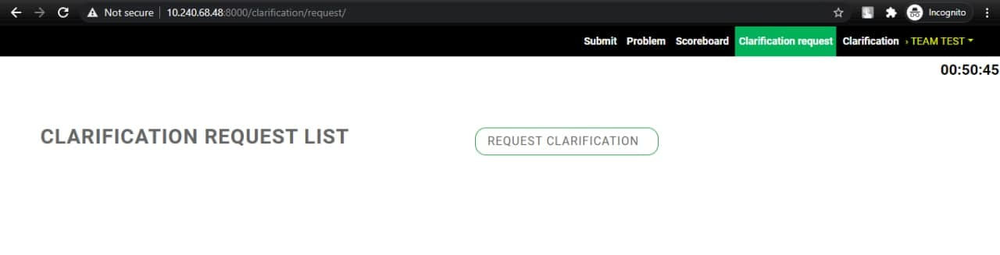
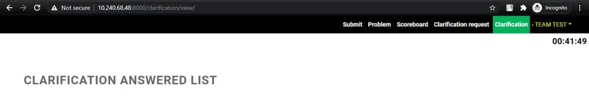

Team Manual
===========
.. admonition:: Summary

   This page gives a short summary of the system interface. The summary is meant as a quick 
   introduction, to be able to start using the system. It is however strongly advised that your team
   reads the entire document. There are specific details of this contest control system that might
   become of importance when you run into problems. BE WARNED!
   
   Andalus Judge works through a web interface that can be found at

   https://example.com/andalusjudge. See figures 9 and 10 on below page for an impression.

   You can submit solutions the following ways:

   Web interface
     From your team page, |baseurlteam|, click the **Submit**
     button in the menu bar. Select the files you want to submit.
     By default, the problem is selected from the base of the (first)
     filename and the language from the extension. The web interface tries
     to auto-detect the main class (for Java) or the main file (for
     Python) from the file name. Double check that the guess is correct
     before submitting.

   Viewing scores, submissions and sending and reading clarification
   requests and replies is done through the web interface at |baseurlteam|.


.. raw:: pdf

    PageBreak

Introductions of team interface
-------------------------------
By now your team has to be registered on the platform by the adminst, please contact 
system administrators. After a successful registration on the system, you will get a url 
the server is running on, a username and a password from system admin.



   Figure 1: Login Page

   Here, enter your team password and username and then after a successful login you will be 
   redirected to this page, if there is no active contest.



   Figure 2: No Active Contest

If there is an active contest the interface will look like as shown below.



   Figure 3: Submission page on active contest

.. raw:: pdf

  :PageBreak

Now let's browse other tabs.

Problems
````````
This will contain problems and information about the problems.

.. figure:: img/problem-list.png
   :width: 80%

   Figure 4: Problems list page

Click on the questions and it will redirect you to the question if you are using chrome browser or
download the question pdf if you are using Mozilla FireFox.



   Figure 5: Problem on Chrome browser

Scoreboard
``````````
You can see from here who is leading and which team solved which question.


   
   Figure 6: Scoreboard page

Clarification Request
`````````````````````
If there is any question error you can ask the judge.


   
   Figure 7: clarification request page

Clarification
`````````````
If any clarification is needed the judge can post it to all teams and you can get it from here.


   
   Figure 8: clarification from system admin page

Reading and writing
-------------------
Solutions have to read all input from ‘standard in’ and write all output to ‘standard out’ (also known
as console). You will never have to open (other) files. See appendix A for some code examples.

.. admonition:: Submitting solutions

  You can submit solutions from the web interface

  Web interface 
    From your team page, https://example.com/andalusjudge, click the Submit button
    in the menu bar. You can submit solutions with file mode or with editor mode.

  File mode 
    Select the file(s) you want to submit. By default, the problem is selected from the base of
    the (first) filename and the language from the extension. The web interface tries to auto-detect the
    main class (for Java) or the main file (for Python 2 and Python 3) from the file name. Double check
    that the guess is correct before submitting.

  Editor mode 
    Click the open editor button in the submit page. Write code and select a problem and
    language for your problem. Then click the submit button. For better visualization check Figure 3
    above.

Viewing scores, submissions, etc.
`````````````````````````````````
Viewing scores, submissions, submitted code and sending and reading clarification requests and
replies is done through the web interface at https://example.com/andalusjudge.
End of summar

.. figure:: img/team-submit-overview.png
   :width: 80%
   
   Figure 9: The team web interface overview page.

.. figure:: img/scoreboard.png
   :width: 80%
   
   Figure 10: The scoreboard webpage.

Submitting solutions
--------------------
Submitting solutions can be done using the web interface. One of the interfaces might not
be available, depending on the system configuration by the jury. A description of both
methods follows.

Note that the current compilers and versions on Andalus CPOJ are: C - gcc version 11, C++ -
g++ version 14, Python2 - 2.7, Python3 - 3.6 and Java - 11.0.

Web interface Solutions can be submitted from the web interface at
https://example.com/andalusjudge. Click the Submit button at the menu bar on every page.
Click the file selection button and select file for submission. Andalus Judge will try to
determine the problem, language and main class (in case of Java) or main file (in case of
Python 2 and 3) from the base and extension of the first filename. Otherwise, select the
appropriate values. File Names must start with an alphanumeric character and may contain
only alphanumeric characters and +. -. After you hit the submit button and confirm the
submission, you will be redirected back to your submission list page. On this page, a
message will be displayed that your submission was successful and the submission should
be present in the list. An error message will be displayed if something went wrong.

Viewing the results of submissions
``````````````````````````````````
Team web page shows an overview of your submissions. It contains all relevant
information: submission time, programming language, problem and status. The address of
your team page is https://example.com/andalusjudge.

The top of the page shows your team’s row in the scoreboard:

your position and which problems you attempted and solved (as shown in figure 1 above). Via the menu you can
view the public scoreboard page with the scores of all teams. Many cells will show
additional “title text” information when hovering over them. The score column lists the
number of solved problems and the total time including penalty time. Each cell in a
problem column lists the number of submissions, and if the problem was solved, the time of
the first correct submission in minutes since the contest started. This is included in your
total time together with any penalty time incurred for previous incorrect submissions.
Optionally the scoreboard can be ‘frozen’ some time before the end of the contest. The full
scoreboard view will not be updated anymore, but your team row will. Your team’s rank
will be displayed as ‘?’. Finally, via the top menu you can also view the list of problems and
view/download problem pdf

Possible results
````````````````
A submission can have the following results (not all of these may be available depending on
configuration of the system).

.. admonition:: Possible result

  JUDGING 
    The submission is being tested.

  CORRECT
    The submission passed all tests: you solved this problem!
    *Correct submissions do not incur penalty time.*

  ``COMPILER-ERROR``
    There was an error when compiling your program. On the submission
    details page you can inspect the exact error (this option might be
    disabled).
    Note that when compilation takes more than |COMPILETIME| seconds,
    it is aborted and this counts as a compilation error.
    *Compilation errors do not incur penalty time.*

  ``TIMELIMIT``
    Your program took longer than the maximum allowed time for this
    problem. Therefore it has been aborted. This might indicate that your
    program hangs in a loop or that your solution is not efficient
    enough.

  ``RUN-ERROR``
    There was an error during the execution of your program. This can have
    a lot of different causes like division by zero, incorrectly
    addressing memory (e.g. by indexing arrays out of bounds), trying to
    use more memory than the limit, etc.
    Also check that your program exits with exit code 0!

  ``NO-OUTPUT``
    Your program did not generate any output. Check that you write to
    standard out.

  ``OUTPUT-LIMIT``
    Your program generated more output than the allowed limit. The solution
    is considered incorrect.

  ``WRONG-ANSWER``
    The output of your program was incorrect. This can happen simply
    because your solution is not correct, but remember that your output
    must comply exactly with the specifications of the judges. See
    :ref:`testing <testing>` below for more details.

  .. _testing:

  TOO-LATE
    Bummer, you submitted after the contest ended! Your submission is
    stored but will not be processed anymore.

The judges may have prepared multiple test files for each problem.
ANDALUSjudge will report back the first non-correct result as verdict.

How are submissions being judged?
---------------------------------
The Andalus Judge contest control system is fully automated. Judging is done in the
following way:

Submitting solutions
````````````````````
With the submit program or the web interface (see section 1) you can submit a solution to a
problem to the judges. Note that you have to submit the source code of your program (and
not a compiled program or the output of your program).

On the contest control system your program enters a queue, awaiting compilation,
execution and testing on one of the auto judges.

Compilation
```````````
Your program will be compiled on an autojudge machine running Linux. All submitted
source files will be passed to the compiler which generates a single program to run. 
For Java the given main class will be checked; for Python 2 and Python 3 we do a syntax check using
the py compile module.

Testing
```````
After your program has compiled successfully it will be executed and
its output compared to the output of the judges. Before comparing the
output, the exit status of your program is checked: if your program
exits with a non-zero exit code, the result will be a run-error
even if the output of the program is correct!
There are some restrictions during execution. If your program violates
these it will also be aborted with a run-error,
see :ref:`the section on restrictions <runlimits>`.

When comparing program output, it has to exactly match to output of
the judges, except that some extra whitespace may be ignored (this
depends on the system configuration of the problems). So take care
that you follow the output specifications. In case of problem
statements which do not have unique output (e.g. with floating point
answers), the system may use a modified comparison function.
This will be documented in the problem description.

.. _runlimits:

Restrictions
````````````
To prevent abuse, keep the jury system stable and give everyone
clear and equal environments, there are some restrictions to which all
submissions are subjected:

.. admonition:: Restrictions

  compile time
    Compilation of your program may take no longer than |COMPILETIME|
    seconds. After that, compilation will be aborted and the result will
    be a compile error. In practice this should never give rise to
    problems. Should this happen to a normal program, please inform the
    judges right away.

  source size
    The total amount of source code in a single submission may not exceed
    |SOURCESIZE| kilobytes, otherwise your submission will be rejected.

  memory
    The judges will specify how much memory you have available during
    execution of your program. This may vary per problem. It is the
    total amount of memory (including program code, statically and
    dynamically defined variables, stack, Java/Python VM, …)!
    If your program tries to use more memory, it will most likely abort,
    resulting in a run error.

  number of processes
    You are not supposed to explicitly create multiple processes (threads). This is
    to no avail anyway, because your program has exactly 1 processor core fully
    at its disposal. To increase stability of the system, ANDALUSjudge
    executes submissions in a sandbox where a maximum of |PROCLIMIT| processes
    can be run simultaneously (including processes that started your program).

    People who have never programmed with multiple processes (or have
    never heard of "threads") do not have to worry: a normal program
    runs in one process.

Clarifications
--------------
All communication with the judges is to be done through clarifications. These can be found
in the Clarification button in the menu bar. Both clarification replies from the judges and
requests sent by you are displayed on the clarification page.

There is also a button in the menu bar to submit a new clarification request to the judges ;
you can associate a specific problem or one of the general categories to a request. This
clarification request is only readable for the judges. The judges can answer specifically to
your team or send a reply to everyone if it is relevant for all.

A Code examples
---------------
Below are a few examples on how to read input and write output for a
problem.

The examples are solutions for the following problem: the first line
of the input contains the number of testcases. Then each testcase
consists of a line containing a name (a single word) of at most 99
characters. For each testcase output the string ``Hello <name>!``
on a separate line.

Sample input and output for this problem:

+------------------+-------------------------+
| Input            | Output                  |
+==================+=========================+
| | ``3``          | | ``Hello world!``      |
| | ``world``      | | ``Hello Jan!``        |
| | ``Jan``        | | ``Hello SantaClaus!`` |
| | ``SantaClaus`` |                         |
+------------------+-------------------------+

Note that the number ``3`` on the first line indicates that 3 testcases
follow.

What follows is a number of possible solutions to this problem
for different programming languages.

.. literalinclude:: examples/example.cc
   :language: cpp
   :caption: *A solution in C++*

.. literalinclude:: examples/example.py
   :language: python
   :caption: *A solution in Python*

